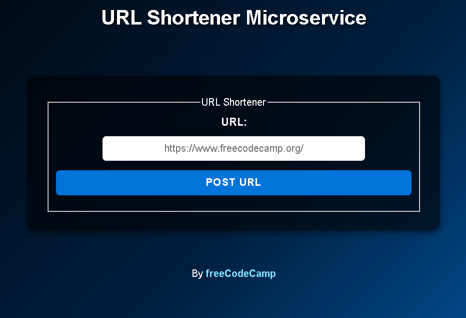

# Microservice: URL Shortener

Este proyecto es una API de acortador de URLs construida con Node.js y Express, siguiendo el reto de freeCodeCamp para microservicios.

## Características
- Acorta URLs válidas usando un endpoint POST.
- Redirige a la URL original usando un endpoint GET.
- Valida que la URL sea real y tenga un dominio válido usando DNS.
- Respuestas JSON claras para errores y resultados.
- Código modular: las rutas y la lógica principal están en `myApp.js`, y el servidor en `index.js`.

## Instalación

1. Clona este repositorio:
   ```sh
   git clone <url-del-repo>
   cd microservice-project-urlshortener
   ```
2. Instala las dependencias:
   ```sh
   npm install
   ```
3. Crea un archivo `.env` si deseas personalizar el puerto (opcional):
   ```env
   PORT=3000
   ```
4. Inicia el servidor:
   ```sh
   npm start
   ```

## Uso

### Acortar una URL
- **POST** `/api/shorturl`
- Body: `{ "url": "https://www.ejemplo.com" }`
- Respuesta: `{ "original_url": "https://www.ejemplo.com", "short_url": 1 }`

### Redirigir a la URL original
- **GET** `/api/shorturl/1`
- Redirige a la URL original asociada.

### Ejemplo visual



## Estructura del proyecto
```
index.js           # Servidor principal (configuración y arranque)
myApp.js           # Lógica de rutas y validación
package.json
README.md
sample.env
public/
  style.css
views/
  index.html
assets/
  microserviceprojecturlshortener.png
```

## Notas
- Este proyecto usa una base de datos en memoria, por lo que los datos se pierden al reiniciar el servidor.
- Solo se aceptan URLs válidas y accesibles por DNS.
- La lógica de rutas y validación está separada en `myApp.js` para mejor organización y escalabilidad.

---

Proyecto para el reto de microservicios de freeCodeCamp.
